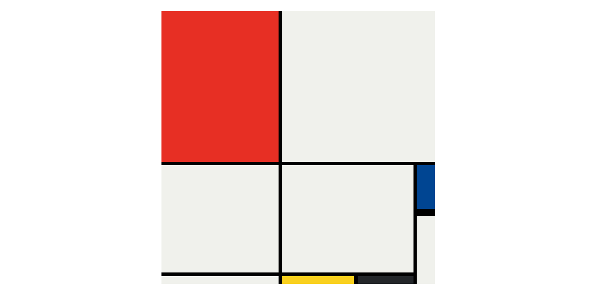

# Mondrian Composition

This repository contains compositions created in the style of Mondrian using HTML and CSS. Each composition attempts to mimic the style of Piet Mondrian's famous abstract paintings.

## Composition 1

This composition is an attempt to recreate a Mondrian-style painting using CSS grid layout. It consists of an grid pattern where squares are arranged in different colors.

***Screenshot of the project***

## Composition 2

This composition is another attempt to recreate a Mondrian-style painting using CSS grid layout. Color blocks are arranged in different sizes and positions.

***Screenshot of the project***

